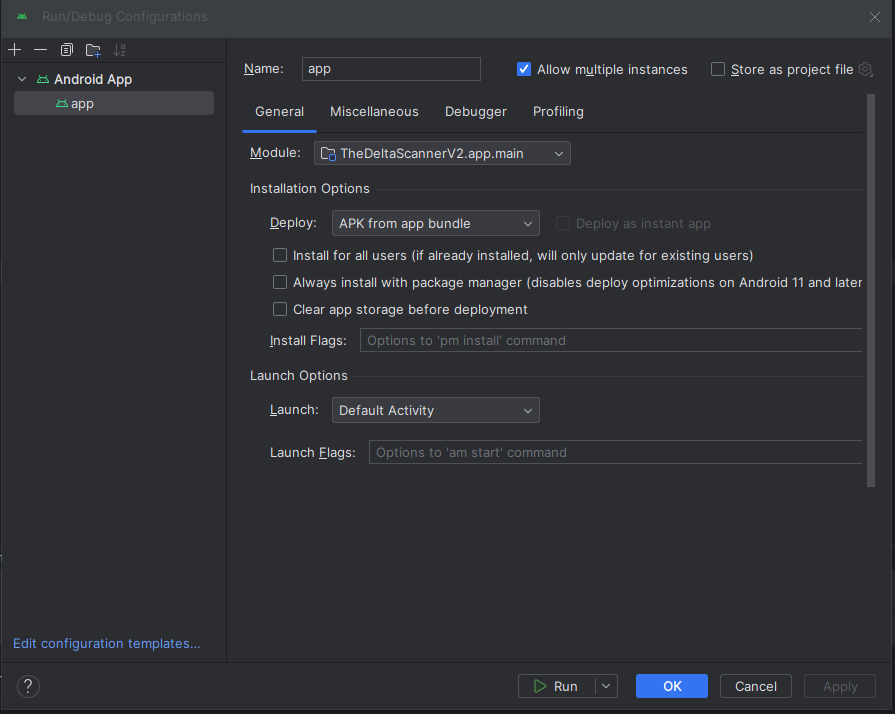

### TheDeltaScannerV2

**About the Project:**

TheDeltaScannerV2 is an Android app designed to showcase the capabilities of barcode and RFID scanning devices. Offering various scanning modes and a plethora of customizable settings, our app strikes a perfect balance between simplicity and functionality. The intuitive GUI display ensures swift navigation, making scanning tasks a breeze.

**Key Features:**
- **Versatile Scanning Modes:** Choose from a range of scanning modes to suit your needs, from barcode to RFID.
- **Customizable Settings:** Tailor the app to your preferences with numerous setting options for an optimized scanning experience.
- **Intuitive GUI:** Enjoy a user-friendly interface that facilitates quick and effortless navigation.
- **Enhanced Compatibility:** Seamlessly integrate with Zebra or Honeywell Android devices for smooth operation.

**New Features (Coming Soon Possibly):**
- **Real-time Analytics:** Track scanning performance and generate detailed analytics reports for better insights.
- **Batch Scanning:** Streamline operations by scanning multiple items at once, increasing efficiency.
- **Cloud Sync:** Synchronize scanned data with cloud storage for seamless access and backup.
- **Customizable Themes:** Personalize the app's appearance with a selection of themes to match your style.
- **Gesture Controls:** Navigate the app with ease using intuitive gesture controls for a smoother user experience.

**Steps for Use:**

1. **Download Android Studio:** Obtain Android Studio for app development.
2. **Open Project:** Navigate to Version Control and enter the repository URL to access the project.
3. **Configure SDK:** In Gradle scripts `local.properties`, update sdk.dir to your SDK file path.
4. **Add Configurations:** Go to the top bar, select "Add Configurations," then choose "Android app" and specify the module `TheDeltaScannerV2.app.main`.
   
5. **Deploy APK:** Select "Deploy (APK from app Bundle)" and click OK to deploy the app.
6. **Build and Run:** Build the project and run it on Zebra or Honeywell Android devices.
7. **Additional Step for Zebra Devices:** Ensure you have downloaded and installed the DataWedge app for Zebra devices.

Explore the enhanced features and elevate your understanding with TheDeltaScannerV2!
